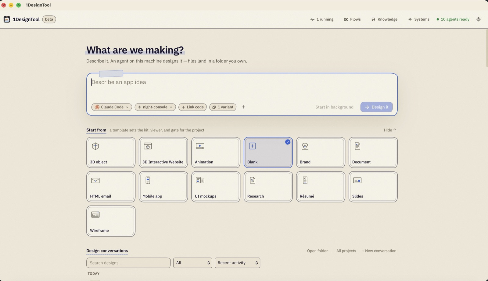
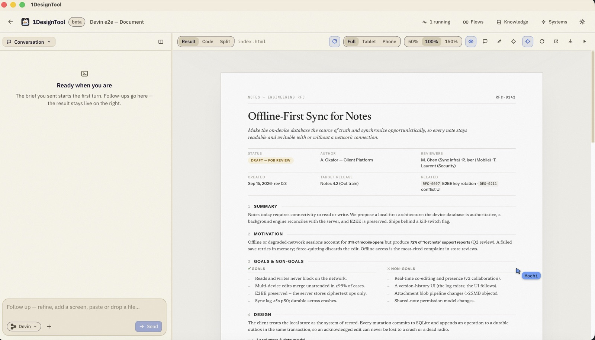
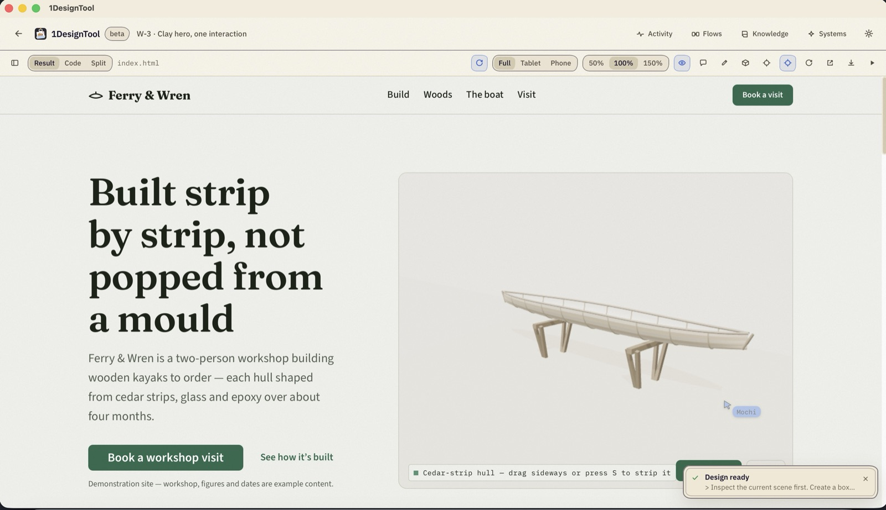
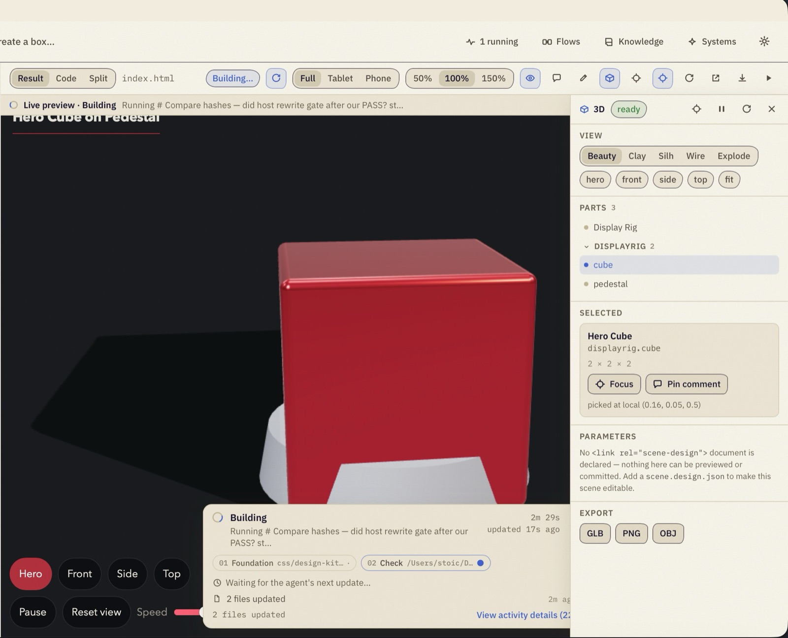
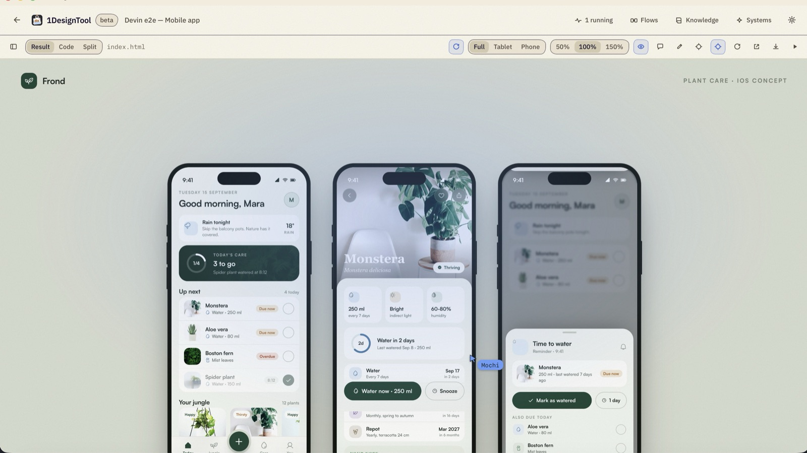
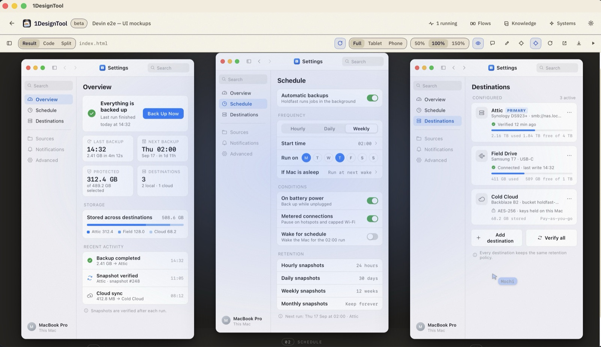
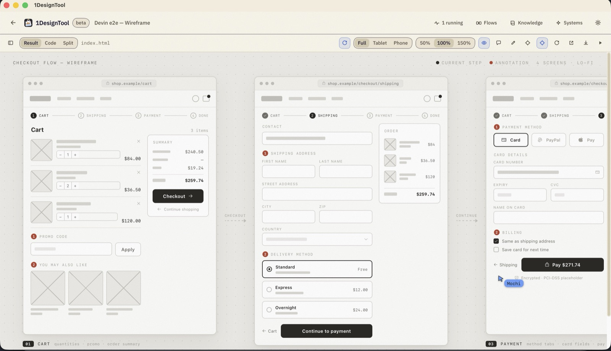
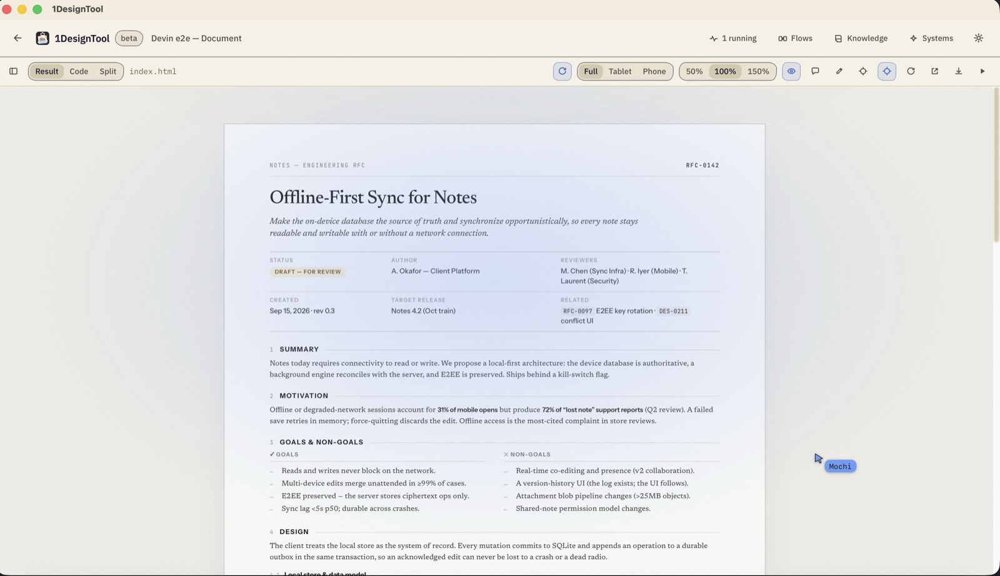

# 1DesignTool

**Describe what you want, and your own coding agent designs it as real files you can
watch, steer, and keep.**

1DesignTool is a local desktop design studio. You type a brief, pick a template, and the
coding CLI you already have installed — Claude Code, Codex, Cursor Agent, Gemini CLI,
Grok, OpenCode, Devin, Amp, Kimi, Qwen, Antigravity — builds it as HTML/CSS/JS in a folder
on your disk. You watch the run in a live result panel, keep talking to it, point at
elements, and export.

- **The artifact is files, not a proprietary document.** Standard web files in a normal
  folder. They open in any browser and belong in git.
- **The engine is your local CLI.** We ship no model, sell no credits, and don't write our
  own agent loop. Your existing subscription is the AI.
- **Buy once, own forever.** Perpetual license, works offline, no account required.

## Demo

▶︎ **[Watch the demo](https://www.youtube.com/watch?v=KALL3l06ffM)**

## Downloads

Grab the newest installer from
[**Releases**](https://github.com/stoicsoft/1DesignTool-releases/releases/latest).

| Platform | File |
|---|---|
| macOS (Apple Silicon) | `.dmg` — `aarch64` |
| macOS (Intel) | `.dmg` — `x64` |
| Windows | `.msi` or `.exe` (NSIS) |
| Linux | `.AppImage` / `.deb` |

## What it looks like

**Start with a brief.** A template sets the kit, the viewer and the check gate for the
project; the agent and design system are picked right on the composer.

**Watch it build, then keep talking.** The conversation runs on the left and the result
stays live on the right — desktop, tablet or phone, at any zoom.

**Real web pages, not mockups of them.** An interactive 3D site, rendered live in the
result panel.

**Inspect and export the scene.** Pick a part, focus it, pin a comment, switch between
beauty, clay, silhouette, wireframe and explode views — then export GLB, PNG or OBJ.

**Phone screens.** The phone viewport with a full iOS concept across three screens.

**Interface mockups.** Multi-window app concepts, laid out and annotated.

**Wireframes.** Lo-fi flows with numbered annotations and step markers.

**Documents.** Typeset pages that stay editable files on your disk.

## Updates

The app updates itself from `latest.json` published with each release. Only published
releases are served — drafts are not.

## Issues

This repository carries the release artifacts; the source lives elsewhere. File bugs and
requests in [Issues](https://github.com/stoicsoft/1DesignTool-releases/issues).
